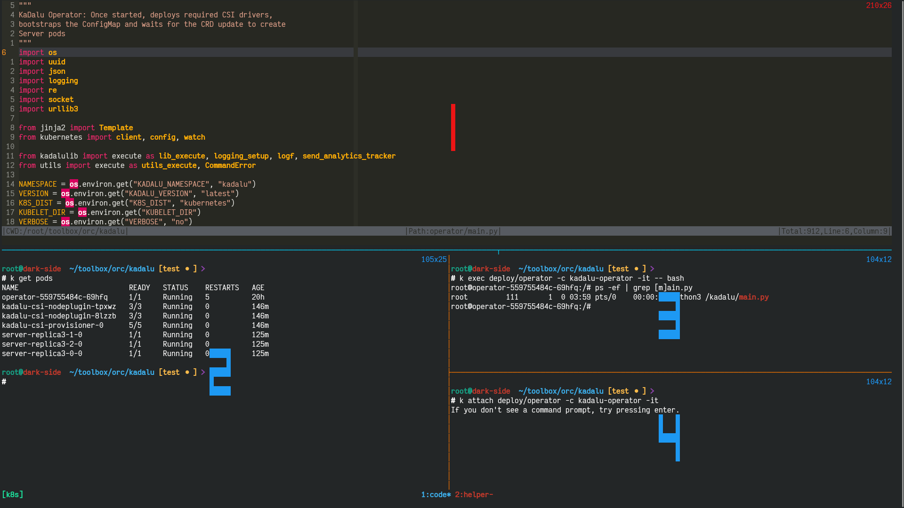

We are picking up where we left off on the discussion about [CSI Driver](https://thoughtexpo.com/exploring-kadalu-storage-in-k3d-cluster-csi-driver/) component of kadalu storage. After the deployment of CSI Pods it's all user facing, adding storage and provisioning PVs etc. 

Today we'll be discussing about where it all starts, namely Kadalu Operator. As always I'll provide references to resources which takes away re-iterating the same concepts.

## Introduction

A kubernetes operator has funtional knowledge on how to manage a piece of tech (here, it's bootstrapping glusterfs to be used in kubernetes) among others. Custom Resource Definitions (CRDs) are at the heart of an operator in which we'll be listening to events on CRD object and turn knobs in managed resource.

Below are mandatory if you didn't come across kubernetes operators or how to use kubernetes python api:
- [Video about Operator](https://youtu.be/MfDpQru0-ok)
- [Article on creating Operator in Python from scratch](https://medium.com/flant-com/kubernetes-operator-in-python-451f2d2e33f3)
- [Article series about Operator](https://flugel.it/infrastructure-as-code/building-kubernetes-operators-part-1-operator-pattern-and-concepts/) (not mandatory)

Since we have already covered a lot of ground in [previous](https://thoughtexpo.com/exploring-kadalu-storage-in-k3d-cluster-csi-driver/) post about Kadalu Project and pre-requisites, we'll be diving directly into the kadalu operator component.

## Deep dive into Operator

We'll be using a lot of python PDB module abilities and directly follow the actions of operator in container itself and a good understanding of python debugger will be useful to follow along. Python [documentation](https://docs.python.org/3/library/pdb.html) on pdb is easy to follow and self sufficient.

As my workflow is heavily CLI based around tmux and neovim I think below image would be helpful going forward to reference on which pane I'll be performing the tasks. 

- Pane1: Any change to the source code will be performed which will be copied into the container
- Pane2: Verfiy the state of the cluster and to run any other adhoc commands
- Pane3: Exec into `kadalu-operator` container running on `operator` pod
- Pane4: Attach to command prompt of `kadalu-operator` container and make sure not a send any `KeyboardInterrupt` (^C) ever

If you are interested in only knowing about how we can enter into PDB in a container, please refer below and rest of the post talks about various ways leveraging this simple concept to illustrate the workflow that happens in the operator.

``` python
-> python -m pdb -c 'import signal' -c 'signal.signal(signal.SIGUSR1, lambda *args: breakpoint())' -cc <pyfile>
```

How it works?
- `-m pdb`: invokes python interpreter in trace mode of pdb
- `-c`: provided to `pdb` as command line arguments
- `import signal`: imports signal module from stdlib into pdb (as the startin word is not a pdb reserved keyword, there's no need to start the statement with `!`, same for next set of commands)
- `signal.signal(signal.SIGUSR1, lambda *args: breakpoint())`: registering a handler for `SIGUSR1` signal, (`breakpoint() [in version >=3.7] =~ import pdb; pdb.set_trace()`)
- `c`: `continue`, without this pdb prompt wait for user input

Pros:
- After the signal handler is registered we can invoke python debugger by running `kill -USR1 <pid>` on python process asynchronously
- We'll have the ability to navigate around last ~10 stack frames and inspect arguments, variables etc
- In general, getting into debugger of a running process without changing any source code is an added benefit, having said that nothing can replace a good logging system :smile:

Cons:
- If the breakpoints are set by dropping into pdb via kill signal, no history/breakpoints will not be restored if the process is restarted with `run/restart` commands :disappointed:

I would say above is a major con however you can evaluate both pros and cons against your use case. In quest of providing resources around pdb I find these articles are good recommendations, [series on pdb](https://python.plainenglish.io/pdb-a-brief-introduction-to-python-debugger-abeaa2da5010) and [pdbrc](https://kylekizirian.github.io/ned-batchelders-updated-pdbrc.html)

Actually the end, the rest of the article explains what happens in the kadalu operator in a greater detail and hang on if you want to see how we can apply above concept for a container running python program. At the time of writing this blog, `HEAD` of [kadalu](https://github.com/kadalu/kadalu) repo is at commit [f86799f](https://github.com/kadalu/kadalu/tree/f86799f89cce34a423d37720eccf9163a86cae99)

### Creating a `k3d` cluster

I've a newly created `k3d` cluster and all operations are performed on that. I usually follow this [script](https://github.com/leelavg/forge/blob/master/adhoc/k3d-kadalu.sh) for creating a cluster, you can modify and use the same. `HEAD` of [forge](https://github.com/leelavg/forge) repo is at commit [73604c](https://github.com/leelavg/forge/tree/73604c5a74fe7d0887f2fe5b70202edf71f47ef4)

Please don't run without checking the script.

``` sh
-> bash <(curl -s https://raw.githubusercontent.com/leelavg/forge/master/adhoc/k3d-kadalu.sh) -m -k n
[...]
```

### Process Monitor (Reconciler)

Every component of Kadalu, i.e., Operator, Server and CSI depends on a core [monitor](https://github.com/kadalu/kadalu/blob/f86799f89cce34a423d37720eccf9163a86cae99/lib/kadalulib.py) process and runs business logic as subprocess and tries it's best to keep child alive.

More than often, if you are debugging any component make sure this monitor is always stable as it works behind the scenes. These monitor methods are imported into `start.py` in every component and triggers a subprocess `main.py` among others which are specific to the component.


#### Overriding docker `entrypoint`

More than often there'll be a confusion between docker entrypoint and kubernetes command directive, please refer this official [doc](https://kubernetes.io/docs/tasks/inject-data-application/define-command-argument-container/) once and for all to understand the difference if you have struggled earlier. Atleast I did find that confusing for some time :disappointed_relieved:

In this method I did override only the entrypoint (`python3 /kadalu/start.py`) specified in the docker image of kadalu-operator as below:
``` diff
-> git diff manifests/kadalu-operator.yaml
diff --git a/manifests/kadalu-operator.yaml b/manifests/kadalu-operator.yaml
index 985a297..9fc372c 100644
--- a/manifests/kadalu-operator.yaml
+++ b/manifests/kadalu-operator.yaml
@@ -271,6 +271,9 @@ spec:
             privileged: true
           image: docker.io/kadalu/kadalu-operator:devel
           imagePullPolicy: IfNotPresent
+          stdin: true
+          tty: true
+          command: ["python3", "-m", "pdb", "-c", "alias reg_sig tbreak /kadalu/kadalulib.py:322;; c;; signal.signal(signal.SIGUSR1, lambda *args:breakpoint());; c;;", "/kadalu/start.py"]
           env:
             - name: WATCH_NAMESPACE
               valueFrom:
@@ -293,4 +296,4 @@ spec:
             - name: K8S_DIST
               value: "kubernetes"
             - name: VERBOSE
-              value: "no"
\ No newline at end of file
+              value: "yes"
```

Setting `stdin` and `tty` as `true` is mandatory to communicate with `pdb`, if these aren't set as soon as you hit `(Pdb)` prompt, `BadQuit` exception is raised and your container goes into failed state after multiple tries.

Here I'm not running any pdb commands but only registering an alias for `reg_sig` and if we deploy above manifest it'll wait for input and we can add any breakpoints if we wish to retain them if init process gets restarted manually or automatically.

By looking at the source I know by the time `kadalulib.py` is called `signal` module is appended to `sys.path`, just for convenience I'm registering the signal handler at this specific line. After deploying above manifest I'm just checking the alias and registering the signal handler.

> Note: `'tbreak'` is called temporary break and get's cleared after it's hit for the first time, `'kubectl attach'` operation is only performed onces until it times out, it's just being shown in the listings to refer to one of above mentioned panes.

``` sh
-> kubectl apply -f manifests/kadalu-operator.yaml
[...]

-> kubectl logs deploy/operator -c kadalu-operator
> /kadalu/start.py(1)<module>()
-> import os
(Pdb)

-> kubectl attach deploy/operator -c kadalu-operator -it
If you don't see a command prompt, try pressing enter.
(Pdb) alias reg_sig
reg_sig = tbreak /kadalu/kadalulib.py:322;; c;; signal.signal(signal.SIGUSR1, lambda *args:breakpoint());; c;;
(Pdb) reg_sig
Breakpoint 1 at /kadalu/kadalulib.py:322
Deleted breakpoint 1 at /kadalu/kadalulib.py:322
> /kadalu/kadalulib.py(322)__init__()
-> if procs is not None:
<Handlers.SIG_DFL: 0>
[...]
```

Now we can send a USR1 signal to reach pdb prompt as below and look at stack frames. 

You'll always be ending up reaching pdb prompt when the start process is sleeping, however knowing that start process is monitoring on children status I can set a breakpoint accordingly and kill the children to figure out any discrepancies while launching child process (if there are any).

``` python
-> kubectl exec deploy/operator -c kadalu-operator -it -- bash
root@operator-67b7866747-gv5tv:/# ps -ef | grep [s]tart.py
root           1       0  0 03:25 pts/0    00:00:00 python3 -m pdb -c alias reg_sig tbreak /kadalu/kadalulib.py:322;; c;; signal.signal(signal.SIGUSR1, lambda *args:breakpoint());; c;; /kadalu/start.py
root@operator-67b7866747-gv5tv:/# kill -USR1 1
root@operator-67b7866747-gv5tv:/#

-> kubectl attach deploy/operator -c kadalu-operator -it
If you don't see a command prompt, try pressing enter.
--Return--
> <stdin>(1)<lambda>()->None
(Pdb) w
  /usr/lib/python3.8/runpy.py(194)_run_module_as_main()
-> return _run_code(code, main_globals, None,
  /usr/lib/python3.8/runpy.py(87)_run_code()
-> exec(code, run_globals)
  /usr/lib/python3.8/pdb.py(1731)<module>()
-> pdb.main()
  /usr/lib/python3.8/pdb.py(1704)main()
-> pdb._runscript(mainpyfile)
  /usr/lib/python3.8/pdb.py(1573)_runscript()
-> self.run(statement)
  /usr/lib/python3.8/bdb.py(580)run()
-> exec(cmd, globals, locals)
  <string>(1)<module>()
  /kadalu/start.py(19)<module>()
-> main()
  /kadalu/start.py(14)main()
-> mon.monitor()
  /kadalu/kadalulib.py(388)monitor()
-> time.sleep(1)
> <stdin>(1)<lambda>()->None
(Pdb) u
> /kadalu/kadalulib.py(388)monitor()
-> time.sleep(1)
(Pdb) locals()
{'self': <kadalulib.Monitor object at 0x7f654cdee070>, 'terminating': False, '_': 'operator', 'state': <kadalulib.ProcState object at 0x7f654cc7eac0>}
(Pdb) p terminating
False
(Pdb) c

-> kubectl exec deploy/operator -c kadalu-operator -it -- bash
root@operator-67b7866747-gv5tv:/# ps -ef | grep [p]ython
root           1       0  0 03:25 pts/0    00:00:00 python3 -m pdb -c alias reg_sig tbreak /kadalu/kadalulib.py:322;; c;; signal.signal(signal.SIGUSR1, lambda *args:breakpoint());; c;; /kadalu/start.py
root           7       1  0 06:06 pts/0    00:00:01 python3 /kadalu/main.py
root@operator-67b7866747-gv5tv:/#
```

#### Using `initContainers` and `postStart`

We are lazy (atleast I'm at times :sweat_smile:) and don't want to make pdb wait for input we can make use of initContainers in conjunction with pdbrc to run commands on dropping into pdb prompt. On a clean `k3d` cluster I've deployed kadalu-operator.yaml with below modifications:

``` diff
-> git diff manifests/kadalu-operator.yaml
diff --git a/manifests/kadalu-operator.yaml b/manifests/kadalu-operator.yaml
index 985a297..8e93c82 100644
--- a/manifests/kadalu-operator.yaml
+++ b/manifests/kadalu-operator.yaml
@@ -271,6 +271,18 @@ spec:
             privileged: true
           image: docker.io/kadalu/kadalu-operator:devel
           imagePullPolicy: IfNotPresent
+          command: ["python3", "-m", "pdb", "/kadalu/start.py"]
+          stdin: true
+          tty: true
+          lifecycle:
+            postStart:
+              exec:
+                command:
+                  - '/usr/bin/sh'
+                  - '-c'
+                  - 'while ! ps -ef | grep [m]ain.py; do sleep 1;
+                    echo Waiting for subprocess to start;
+                    done && umount /root/.pdbrc'
           env:
             - name: WATCH_NAMESPACE
               valueFrom:
@@ -293,4 +305,22 @@ spec:
             - name: K8S_DIST
               value: "kubernetes"
             - name: VERBOSE
-              value: "no"
\ No newline at end of file
+              value: "yes"
+          volumeMounts:
+            - name: pdbrc
+              mountPath: "/root/.pdbrc"
+              subPath: ".pdbrc"
+      initContainers:
+        - name: pdbrc
+          image: busybox
+          command:
+            - 'sh'
+            - '-c'
+            - 'printf "%s\n%s\n%s\n%s" "tbreak /kadalu/kadalulib.py:322" "continue"
+              "signal.signal(signal.SIGUSR1, lambda *args: breakpoint())" "continue" > /pdbrc/.pdbrc'
+          volumeMounts:
+          - name: pdbrc
+            mountPath: "/pdbrc"
+      volumes:
+      - name: pdbrc
+        emptyDir: {}
```

After looking at above, you might be of opnion of why to go through all this hassle rather than just `import signal` and set a `breakpoint()` in `command` value itself.

However there might be scenarios where you would want to set an actual breakpoint using `break`/`tbreak` and ensure that's hit even after restart, in that case you need to use similar manifest as above as setting `break` from `-c` isn't working (as expected?).

Let's see what's going on in above manifest:
- Using an initContainer in conjunction with `emptyDir` I'm creating a `pdbrc` file
- As `kadalu-operator` container starts after initContainer, I'm making `.pdbrc` file available to it using `subPath` and `pdb` reads this rc file

Before explaning why `lifecycle` stanza is required let me show you what happens if we miss this stanza, I applied manifest and sent a signal similar to what we have done in above method.

``` sh
-> kubectl apply -f manifests/kadalu-operator.yaml
[...]

-> kubectl logs deploy/operator -c kadalu-operator
Breakpoint 1 at /kadalu/kadalulib.py:322
Deleted breakpoint 1 at /kadalu/kadalulib.py:322
<Handlers.SIG_DFL: 0>
[...]

-> kubectl exec deploy/operator -c kadalu-operator -it -- bash
root@operator-965866889-grl87:/# ps -ef | grep [p]ython
root           1       0  0 06:06 pts/0    00:00:00 python3 -m pdb /kadalu/start.py
root           7       1  3 06:06 pts/0    00:00:01 python3 /kadalu/main.py
root@operator-965866889-grl87:/# kill -USR1 1

-> kubectl attach deploy/operator -c kadalu-operator -it
If you don't see a command prompt, try pressing enter.
--Return--
Breakpoint 2 at /kadalu/kadalulib.py:322
```

Because of the presence of `.pdbrc`, pdb prompt didn't wait for user input (as last command is `continue`) and ran all the commands (can be referred from `kubectl logs`), however here's a gotcha you can see whenever we send a `kill -USR1 1` signal it's dropping in pdb and reading `.pdbrc` and continuing the execution path, for that to not happen we need to perform below and `lifecycle` stanze serves the same need:

``` sh
-> kubectl exec deploy/operator -c kadalu-operator -it -- bash
root@operator-965866889-grl87:/# df -ha | grep pdbrc
tmpfs                3.9G  611M  3.3G  16% /root/.pdbrc
root@operator-965866889-grl87:/# umount /root/.pdbrc
root@operator-965866889-grl87:/# df -ha | grep pdbrc
root@operator-965866889-grl87:/# kill -USR1 1
```

After deploying the manifest with `postStart`, whenever we send a USR1 signal we'll drop into pdb without any issues:
``` sh
-> kubectl attach deploy/operator -c kadalu-operator -it
If you don't see a command prompt, try pressing enter.
--Return--
> <stdin>(1)<lambda>()->None
(Pdb) w
  /usr/lib/python3.8/runpy.py(194)_run_module_as_main()
-> return _run_code(code, main_globals, None,
  /usr/lib/python3.8/runpy.py(87)_run_code()
-> exec(code, run_globals)
  /usr/lib/python3.8/pdb.py(1731)<module>()
-> pdb.main()
  /usr/lib/python3.8/pdb.py(1704)main()
-> pdb._runscript(mainpyfile)
  /usr/lib/python3.8/pdb.py(1573)_runscript()
-> self.run(statement)
  /usr/lib/python3.8/bdb.py(580)run()
-> exec(cmd, globals, locals)
  <string>(1)<module>()
  /kadalu/start.py(19)<module>()
-> main()
  /kadalu/start.py(14)main()
-> mon.monitor()
  /kadalu/kadalulib.py(388)monitor()
-> time.sleep(1)
> <stdin>(1)<lambda>()->None
(Pdb) c
```

### Debugging Kadalu Operator

If you are wondering whether above methods have any connection with actual operator implementation or not then the answer would be, only a slight connection, it's just that `start.py` launches `main.py` that performs operator logic which is, the deployment of config map, storage classes, csi pods and watch event stream for any operations on kadalu storage CRD.

Until now, we are not touching python source but only adding few steps to deployment config. However there's limitation that we can't reach `main.py` from `start.py` due to below style of launching subprocess. Even if we make changes to this code and use `send_signal`, it's tough to manipulate multiple child processes.

``` python
# sed -n '293,300p' lib/kadalulib.py 
    def start(self):
        """Start a Process"""
        self.subproc = subprocess.Popen(
            self.proc.with_args(),
            stderr=sys.stderr,
            universal_newlines=True,
            env=os.environ
        )
```

We'll just use above limitation to our advantage and set a signal handler on `main.py` (`kubectl cp` to container) itself to reach pdb prompt knowing that if we kill child monitor just restarts the child and automatically it picks up new file (similar to what was stated in previous post).

I applied `manifests/kadalu-operator.yaml` without any changes and once all the below resources are created by `kadalu-operator` ...

``` sh
-> kubectl get sc,sts,ds; k get cm kadalu-info;
NAME                                          PROVISIONER   RECLAIMPOLICY   VOLUMEBINDINGMODE   ALLOWVOLUMEEXPANSION   AGE
storageclass.storage.k8s.io/kadalu.replica3   kadalu        Delete          Immediate           true                   8m32s
storageclass.storage.k8s.io/kadalu.replica2   kadalu        Delete          Immediate           true                   8m31s
storageclass.storage.k8s.io/kadalu.replica1   kadalu        Delete          Immediate           true                   8m30s
storageclass.storage.k8s.io/kadalu            kadalu        Delete          Immediate           true                   8m29s

NAME                                      READY   AGE
statefulset.apps/kadalu-csi-provisioner   1/1     13m

NAME                                   DESIRED   CURRENT   READY   UP-TO-DATE   AVAILABLE   NODE SELECTOR   AGE
daemonset.apps/kadalu-csi-nodeplugin   2         2         2       2            2           <none>          13m

NAME          DATA   AGE
kadalu-info   2      16m
```

... patch the deploy/operator resource to support `stdin` and `tty` using below manifest

```
-> bat /tmp/patch.yaml --plain
spec:
  template:
    spec:
      containers:
      - name: kadalu-operator
        stdin: true
        tty: true

-> kubectl patch deployments.apps operator --patch "$(cat /tmp/patch.yaml)"
[...]
```

Now, all the things are in place to trace the steps that operator performs, I made below changes and copied the source to `kadalu-operator` container
``` diff
# git diff operator/main.py
diff --git a/operator/main.py b/operator/main.py
index 0a13e27..7d1509d 100644
--- a/operator/main.py
+++ b/operator/main.py
@@ -905,5 +905,8 @@ if __name__ == "__main__":
     # ignore these warnings as we know to make calls only inside of
     # kubernetes cluster
     urllib3.disable_warnings()
-
+    import signal
+    signal.signal(signal.SIGUSR1, lambda *args: breakpoint())
+    from time import sleep
+    sleep(10)
     main()
```
``` sh
-> kubectl cp operator/main.py $(kubectl get pods -l name=kadalu --no-headers | awk '{print $1}'):/kadalu/main.py
```

We can delete the resources created by the operator, kill `main.py` to pick up changed file and before execution goes past `sleep(10)` we need to send a USR1 signal as below

``` sh
-> kubectl delete sc,sts,ds --all; k delete cm kadalu-info;
storageclass.storage.k8s.io "kadalu.replica3" deleted
storageclass.storage.k8s.io "kadalu.replica2" deleted
storageclass.storage.k8s.io "kadalu.replica1" deleted
storageclass.storage.k8s.io "kadalu" deleted
statefulset.apps "kadalu-csi-provisioner" deleted
daemonset.apps "kadalu-csi-nodeplugin" deleted
configmap "kadalu-info" deleted

-> kubectl get pods
NAME                        READY   STATUS    RESTARTS   AGE
operator-559755484c-69hfq   1/1     Running   3          70m

-> kubectl exec deploy/operator -c kadalu-operator -it -- bash
root@operator-559755484c-69hfq:/# ps -ef | grep [m]ain.py | awk '{print $2}' | xargs  kill
root@operator-559755484c-69hfq:/# ps -ef | grep [m]ain.py | awk '{print $2}' | xargs  kill -USR1
```

Finally we are in pdb prompt and `main.py` execution is stopped and refer below listing and inline comments to figure out the steps being performed by the operator

``` python
-> kubectl attach deploy/operator -c kadalu-operator -it 
If you don't see a command prompt, try pressing enter.
--Return--
> /kadalu/main.py(909)<lambda>()->None
-> signal.signal(signal.SIGUSR1, lambda *args: breakpoint())
(Pdb) w
  /kadalu/main.py(911)<module>()
-> sleep(10)
> /kadalu/main.py(909)<lambda>()->None
-> signal.signal(signal.SIGUSR1, lambda *args: breakpoint())
(Pdb) l .
904         # This not advised in general, but in kadalu's operator, it is OK to
905         # ignore these warnings as we know to make calls only inside of
906         # kubernetes cluster
907         urllib3.disable_warnings()
908         import signal
909  ->     signal.signal(signal.SIGUSR1, lambda *args: breakpoint())
910         from time import sleep
911         sleep(10)
912         main()
[EOF]

# ----------------------------------------------------
# Setting temporary debug points at important methods
# just before deploying resources
# ----------------------------------------------------

(Pdb) tbreak deploy_config_map
Breakpoint 1 at /kadalu/main.py:806
(Pdb) tbreak deploy_csi_pods
Breakpoint 2 at /kadalu/main.py:773
(Pdb) tbreak deploy_storage_class
Breakpoint 3 at /kadalu/main.py:841
(Pdb) tbreak crd_watch
Breakpoint 4 at /kadalu/main.py:745
(Pdb) c

# -----------------------------------------------------------------
# First, an uid is generated and kadalu-info configmap is deployed
# All yaml files are pre-made using Jinja2 templating and values
# are filled before applying those manifests
# -----------------------------------------------------------------

Deleted breakpoint 1 at /kadalu/main.py:806
> /kadalu/main.py(809)deploy_config_map()
-> configmaps = core_v1_client.list_namespaced_config_map(
(Pdb) a
core_v1_client = <kubernetes.client.api.core_v1_api.CoreV1Api object at 0x7f2b8f93bf10>
(Pdb) tbreak 835
Breakpoint 5 at /kadalu/main.py:835
(Pdb) c
[...]
Deleted breakpoint 5 at /kadalu/main.py:835
> /kadalu/main.py(835)deploy_config_map()
-> if not upgrade:
(Pdb) upgrade
False
(Pdb) filename
'/kadalu/templates/configmap.yaml'
(Pdb) pp open(filename).read()
('# -*- mode: yaml -*-\n'
 '---\n'
 'kind: ConfigMap\n'
 'apiVersion: v1\n'
 'metadata:\n'
 '  name: kadalu-info\n'
 '  namespace: kadalu\n'
 'data:\n'
 '  volumes: ""\n'
 '  uid: c00cb7a2-8196-46b3-aafa-7974f3c34666')
(Pdb) c
[...]

# ----------------------
# CSI pods are deployed
# ----------------------

Deleted breakpoint 2 at /kadalu/main.py:773
> /kadalu/main.py(778)deploy_csi_pods()
-> pods = core_v1_client.list_namespaced_pod(
(Pdb) tbreak 802
Breakpoint 6 at /kadalu/main.py:802
(Pdb) c
[...]
Deleted breakpoint 6 at /kadalu/main.py:802
> /kadalu/main.py(802)deploy_csi_pods()
-> lib_execute(KUBECTL_CMD, APPLY_CMD, "-f", filename)
(Pdb) filename
'/kadalu/templates/csi.yaml'
(Pdb) KUBECTL_CMD
'/usr/bin/kubectl'
(Pdb) APPLY_CMD
'apply'
(Pdb) c
[...]

# -------------------------------------------------------------
# All storage classes are deployed, currently Kadalu supports
# Replica1, Replica2, Replica3 natively and Disperse support is
# up for review and already supports external gluster cluster.
# -------------------------------------------------------------

Deleted breakpoint 3 at /kadalu/main.py:841
> /kadalu/main.py(844)deploy_storage_class()
-> api_instance = client.StorageV1Api()
(Pdb) tbreak 861
Breakpoint 7 at /kadalu/main.py:861
(Pdb) c
[...]
Deleted breakpoint 7 at /kadalu/main.py:861
> /kadalu/main.py(861)deploy_storage_class()
-> template(filename, namespace=NAMESPACE, kadalu_version=VERSION)
(Pdb) filename
'/kadalu/templates/storageclass-kadalu.replica3.yaml'
(Pdb) c
[...]

# -----------------------------------------------------------------
# After above resources are deployed operator waits for any
# requests on Kadalu Storage CRD and performs subsequent operations.
# If we didn't provide 'sleep' we'll be ending up at this point
# where operator just waits for request to be served.
# -----------------------------------------------------------------

Deleted breakpoint 4 at /kadalu/main.py:745
> /kadalu/main.py(749)crd_watch()
-> crds = client.CustomObjectsApi(k8s_client)
(Pdb) b
(Pdb) b 764
Breakpoint 8 at /kadalu/main.py:764
(Pdb) b
Num Type         Disp Enb   Where
8   breakpoint   keep yes   at /kadalu/main.py:764
```

Let's add some storage to kadalu and see how they are being handled in brief. I'm using paths on same node just as a demo. As you can see from below above breakpoint is hit when storage is being handed and we just need to watch kubernetes event stream (using python api), it's that simple :smile:

``` yaml
-> bat ../storage-config-path-minimal.yaml --plain; 
---
apiVersion: kadalu-operator.storage/v1alpha1
kind: KadaluStorage
metadata:
  name: replica3
spec:
  type: Replica3
  storage:
    - node: k3d-test-agent-0
      path: /mnt/sdc
    - node: k3d-test-agent-0
      path: /mnt/sdd
    - node: k3d-test-agent-0
      path: /mnt/sde

-> kubectl apply -f ../storage-config-path-minimal.yaml
kadalustorage.kadalu-operator.storage/replica3 created
```
``` sh
[...]
(Pdb) b
Num Type         Disp Enb   Where
8   breakpoint   keep yes   at /kadalu/main.py:764
(Pdb) c
> /kadalu/main.py(764)crd_watch()
-> logging.debug(logf("Event", operation=operation, object=repr(obj)))
(Pdb) operation
'ADDED'
(Pdb) c
[...]
```

Operator deploys one pod for every storage path specified above which acts as a backend gluster brick, config map is updated with volume (`replica3`) info and upon receiving any request for PVC on this backend volume, a subdir corresponding to PVC will be created and served as storage for PV and this connects us back to previous post on CSI Driver


``` sh
-> kubectl get pods
NAME                          READY   STATUS    RESTARTS   AGE
operator-559755484c-69hfq     1/1     Running   0          18h
kadalu-csi-nodeplugin-tpxwz   3/3     Running   0          23m
kadalu-csi-nodeplugin-8lzzb   3/3     Running   0          23m
kadalu-csi-provisioner-0      5/5     Running   0          23m
server-replica3-1-0           1/1     Running   0          2m
server-replica3-2-0           1/1     Running   0          119s
server-replica3-0-0           1/1     Running   0          2m1s

-> kubectl describe cm kadalu-info 
Name:         kadalu-info
Namespace:    kadalu
Labels:       <none>
Annotations:  <none>

Data
====
volumes:
----

# Broken into new lines for readability
replica3.info:
----
{'bricks': [{'brick_device': '',
             'brick_device_dir': '',
             'brick_index': 0,
             'brick_path': '/bricks/replica3/data/brick',
             'host_brick_path': '/mnt/sdc',
             'kube_hostname': 'k3d-test-agent-0',
             'node': 'server-replica3-0-0.replica3',
             'node_id': '20c47b4c-ac91-11eb-aeca-3a728c8b6546',
             'pvc_name': ''},
            {'brick_device': '',
             'brick_device_dir': '',
             'brick_index': 1,
             'brick_path': '/bricks/replica3/data/brick',
             'host_brick_path': '/mnt/sdd',
             'kube_hostname': 'k3d-test-agent-0',
             'node': 'server-replica3-1-0.replica3',
             'node_id': '20c480a6-ac91-11eb-aeca-3a728c8b6546',
             'pvc_name': ''},
            {'brick_device': '',
             'brick_device_dir': '',
             'brick_index': 2,
             'brick_path': '/bricks/replica3/data/brick',
             'host_brick_path': '/mnt/sde',
             'kube_hostname': 'k3d-test-agent-0',
             'node': 'server-replica3-2-0.replica3',
             'node_id': '20c485b0-ac91-11eb-aeca-3a728c8b6546',
             'pvc_name': ''}],
 'kadalu_version': 'devel',
 'namespace': 'kadalu',
 'options': {},
 'type': 'Replica3',
 'volname': 'replica3',
 'volume_id': '20c46b98-ac91-11eb-aeca-3a728c8b6546'}

uid:
----
c00cb7a2-8196-46b3-aafa-7974f3c34666
Events:  <none>
```

Operator watches event stream for three operations as stated below and dispatches to the method which handles that operation

``` python {linenos=table,hl_lines=[22,24,26],linenostart=744}
# sed -n '745,770p' operator/main.py 
def crd_watch(core_v1_client, k8s_client):
    """
    Watches the CRD to provision new PV Hosting Volumes
    """
    crds = client.CustomObjectsApi(k8s_client)
    k8s_watch = watch.Watch()
    resource_version = ""
    for event in k8s_watch.stream(crds.list_cluster_custom_object,
                                  "kadalu-operator.storage",
                                  "v1alpha1",
                                  "kadalustorages",
                                  resource_version=resource_version):
        obj = event["object"]
        operation = event['type']
        spec = obj.get("spec")
        if not spec:
            continue
        metadata = obj.get("metadata")
        resource_version = metadata['resourceVersion']
        logging.debug(logf("Event", operation=operation, object=repr(obj)))
        if operation == "ADDED":
            handle_added(core_v1_client, obj)
        elif operation == "MODIFIED":
            handle_modified(core_v1_client, obj)
        elif operation == "DELETED":
            handle_deleted(core_v1_client, obj)
```

Finally, most if not all the operations that we have seen from pdb can easily be viewed from logs however this'll come handy when you are debugging operator or any python application in general.

We'll be covering how kadalu manages/uses glusterfs underneath and provides a streamlined process for consuming storage in kubernetes workloads in a later post.

## Summary

At times pdb can be hard to manage however if you can pick one of the workflows that suits you and spend some time refining it, you'll be learning a lot and effectively reducing the feedback loop between development and testing cycles. One tip would be, if you are dropped into pdb when the main process is sleeping go up (`u`) the stack and step (`s`) into the process.

The concepts shared here can be used in any normal python program and I felt it'd be helpful to use these concepts in real-time to breakdown and understand complex piece of software one step at a time. 

I hope this helped in cementing some of the operations performed by a typical kubernetes operator and motivate you to contribute to open source projects.

